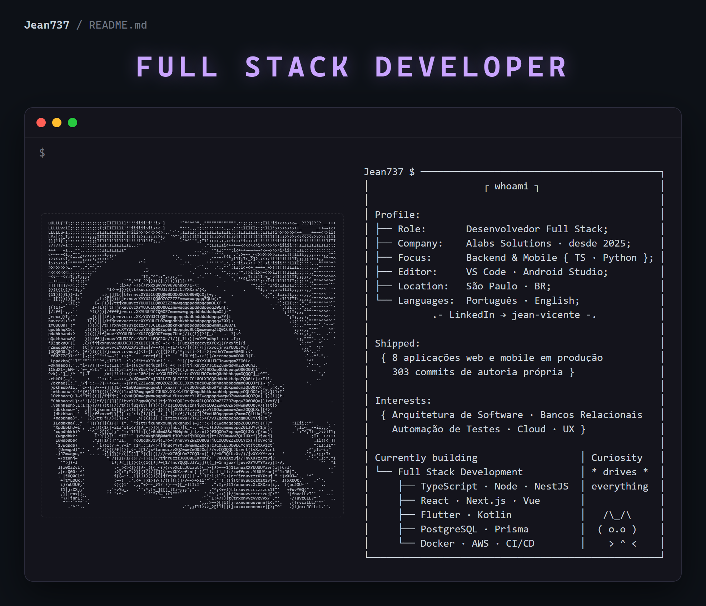

  

  
  

---

### Sobre

Desenvolvedor Full Stack na **Alabs Solutions** desde setembro de 2025. Atuo no ciclo
completo dos produtos: requisitos, modelagem de dados, backend, frontend, automação de
testes, publicação e sustentação.

Oito aplicações web e mobile em produção, com **303 commits de autoria própria** no
histórico da organização.

### Stack

  
  
  
  
  
  
  
  
  
  
  
  
  

### Projetos

| Projeto | O que é | Stack |
| --- | --- | --- |
| **TeoriCar** | Plataforma web e mobile de preparação para a prova do DETRAN, com simulados por IA e assinatura | React · TypeScript · Node · Prisma · PostgreSQL |
| **Postul** | App de localização de postos de combustível com comparação de preços e rotas | Flutter · Supabase · Google Maps |
| **EU ESTOU VIVO** | App de segurança pessoal com check-in periódico e acionamento de contatos de emergência | Flutter · FastAPI · PostgreSQL · Twilio |
| **NOBET** | App Android nativo de bloqueio de conteúdo de apostas, com serviço em segundo plano | Kotlin · Jetpack Compose · Room · Hilt |

---

  
  

